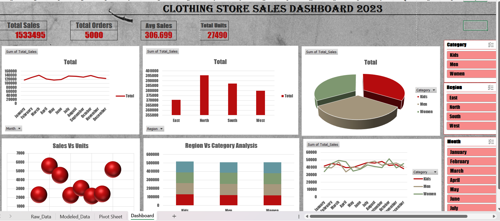

# sales-data-analysis-dashboard
Analyzed 5,000+ clothing store sales records using Excel. Applied Power Query for data cleaning and Power Pivot with DAX for modeling. Built an interactive dashboard with KPIs, slicers, and timeline to track trends, regional performance, and product insights, enabling data-driven business decisions.
# 📊 Sales Data Analysis – Clothing Store 2023

## 📌 Project Overview
Analyzed clothing store sales data to identify trends, track performance, and generate business insights using advanced Excel techniques.

---

## 🛠 Tools Used
- Microsoft Excel
- Power Query
- Power Pivot
- DAX
- Pivot Tables & Charts
- Slicers & Timeline

---

## 📂 Dataset
- 5,000+ records
- Fields include:
  - Order ID
  - Date
  - Region
  - Category
  - Product
  - Units Sold
  - Unit Price
  - Total Sales

---

## 📊 Dashboard Features
- Interactive KPI cards:
  - Total Sales
  - Total Orders
  - Avg Sales
  - Total Units
- Monthly trend analysis
- Region and category performance
- Product-level insights
- Slicers and timeline for filtering

---

## 📈 Insights
- Sales increased in Q4 due to seasonal demand
- Certain regions contributed higher revenue
- Top products drove majority of sales

---

## 🖼 Dashboard Preview

---

## 🚀 How to Use
1. Download the Excel file
2. Open in Excel
3. Use slicers to interact with dashboard

---

## 💼 Skills Demonstrated
- Data Cleaning
- Data Modeling
- Data Visualization
- Business Analysis
